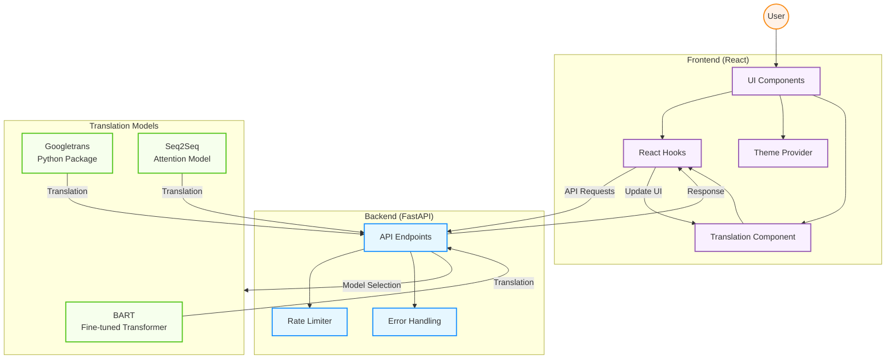
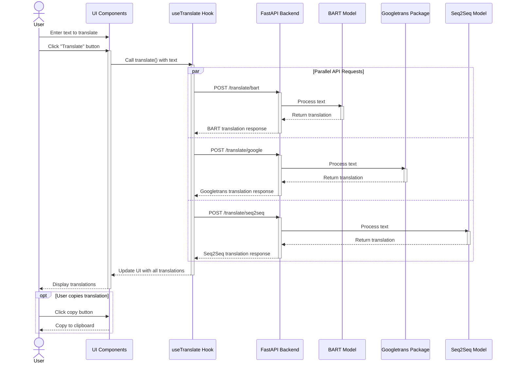

# Neural Machine Translation Web Application

A modern web application that demonstrates and compares different approaches to neural machine translation (NMT) for English to French translation, featuring three translation models:

- **BART**: A fine-tuned BART model for English-French translation
- **Googletrans**: Free and open-source Python library for Google Translate
- **Seq2Seq**: Custom sequence-to-sequence model with attention mechanism

## Project Overview

This project implements a custom neural machine translation system with a modern React frontend and FastAPI backend. It allows users to compare translations from different models side by side.

### Features

- Clean, responsive UI with dark/light mode
- Simultaneous translation using three different models
- Copy translations to clipboard with a single click
- Rate-limited API to prevent overloading models
- Error handling with user-friendly notifications
- Support for GPU acceleration when available

## Core Components



## Interaction Flow



## Tech Stack

### Frontend
- React 19 with TypeScript
- Vite 
- Tailwind CSS
- TanStack Query

### Backend
- FastAPI for API server
- PyTorch for running the ML models
- Hugging Face Transformers for BART model
- Custom Seq2Seq implementation
- Googletrans package for Google Translate service access
- SlowAPI for rate limiting


## Translation Models

### BART Model
A fine-tuned BART (Bidirectional and Auto-Regressive Transformers) model specifically adapted for English-French translation. The model uses beam search with a width of 4 for generating translations.

### Googletrans
A free and open-source Python library that implements the Google Translate API. It allows for simple and easy access to Google's neural machine translation service without requiring API keys or paid subscriptions.

### Custom Seq2Seq Model
A custom-built sequence-to-sequence model with attention mechanism. It consists of:
- Encoder: Processes the input English text
- Attention Mechanism: Helps the model focus on relevant parts of the source sentence
- Decoder: Generates the French translation

## Setup and Installation

### Backend Setup

1. Navigate to the backend directory:
```bash
cd web-app/backend
```

2. Create a virtual environment:
```bash
python -m venv venv
source venv/bin/activate  # On Windows: venv\Scripts\activate
```

3. Install dependencies:
```bash
pip install -r requirements.txt
```

4. Start the server:
```bash
uvicorn app:app --reload
```

The backend will be available at `http://localhost:8000`.

### Frontend Setup

1. Navigate to the frontend directory:
```bash
cd web-app/frontend
```

2. Install dependencies:
```bash
npm install
```

3. Start development server:
```bash
npm run dev
```

The frontend will be available at `http://localhost:5173`.

## References

- [HuggingFace BART Model](https://huggingface.co/facebook/bart-base)
- [Googletrans Package](https://pypi.org/project/googletrans/)
- [Tatoeba Dataset](https://tatoeba.org/en/downloads)
- [Neural Machine Translation Repository](https://github.com/Guri10/neural-machine-translation)